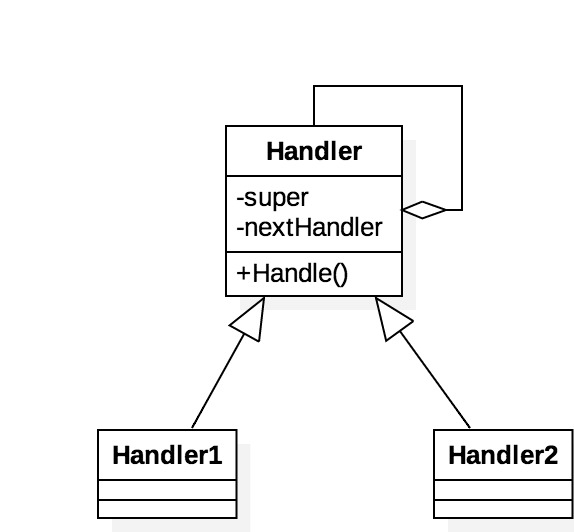

# ***Design Patterns For C++ ***

## 1. Creational Patterns

### 1.1 Builder

### 1.2 Factory

### 1.2.2 Abstract Factory

### 1.3 Prototype

### 1.4 Singleton

## 2. Structural Patterns

### 2.1 Adapter 

### 2.2 Bridge

### 2.3 Comosite

### 2.3.1 Decorator

### 2.4 Facade

### 2.5 Flyweight

### 2.6 Proxy

### 2.7 Curously Recurring Template

### 2.8 Interface-based Programing(IBP)

## 3. Behavioral Patterns

### 3.1 Chain of Responsiblity

Example : 현금지급기(ATM)의 경우, 고객의 예금 인출금에 따라  5만원,1만원,5천원,1천원 순으로 갯수를 정하는 알고리즘을 사용함.

